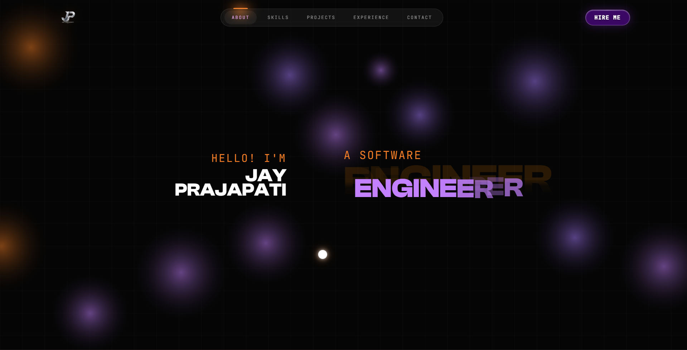

<div align="center">

# ⚡ Jay Prajapati Portfolio

### Futuristic Developer Portfolio • Cinematic UI • Premium Experience



<br/>


</div>

---

# ✨ Overview

A premium futuristic developer portfolio crafted with modern UI/UX aesthetics, cinematic lighting, smooth animations, custom cursor interactions, and high-end frontend experiences inspired by Awwwards websites.

Built to showcase:
- Projects
- Skills
- Experience
- Creative Development
- Interactive UI Design

---

# 🚀 Features

✅ Modern Dark Cinematic UI  
✅ Smooth Custom Cursor  
✅ Advanced Hover Animations  
✅ Glassmorphism Effects  
✅ Premium Animated Navbar  
✅ Fully Responsive Design  
✅ Optimized Performance  
✅ Interactive Sections  
✅ Smooth Scrolling Experience  
✅ Beautiful Typography & Lighting  

---

# 🛠️ Tech Stack

```bash
React.js
Vite
TypeScript
Tailwind CSS
Framer Motion
GSAP
````

---

# 📸 Preview

<div align="center">


</div>

---

# ⚙️ Installation

```bash
# Clone Repository
git clone https://github.com/jayprajapati27/jayprajapati-portfolio.git

# Open Folder
cd jayprajapati-portfolio

# Install Dependencies
npm install

# Run Development Server
npm run dev
```

---

# 🌐 Live Demo

```bash
Coming Soon...
```

---

# 📂 Folder Structure

```bash
src/
 ┣ assets/
 ┣ components/
 ┣ pages/
 ┣ animations/
 ┣ styles/
 ┗ utils/

public/
```

---

# 🎨 Design Inspiration

Inspired by:

* Awwwards
* Modern SaaS Websites
* Cinematic UI Design
* Futuristic Interfaces

---

# 👨‍💻 Author

## Jay Prajapati

Software Engineer • Frontend Developer • Creative UI Designer

---

# ⭐ Support

If you like this project:

```txt
Give this repository a ⭐ on GitHub
```

---

<div align="center">

### ⚡ Designed & Developed by Jay Prajapati

</div>
